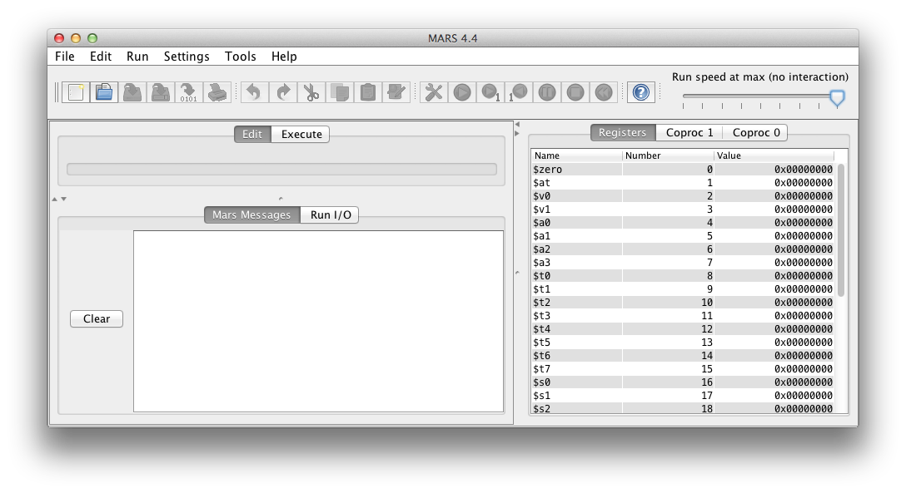
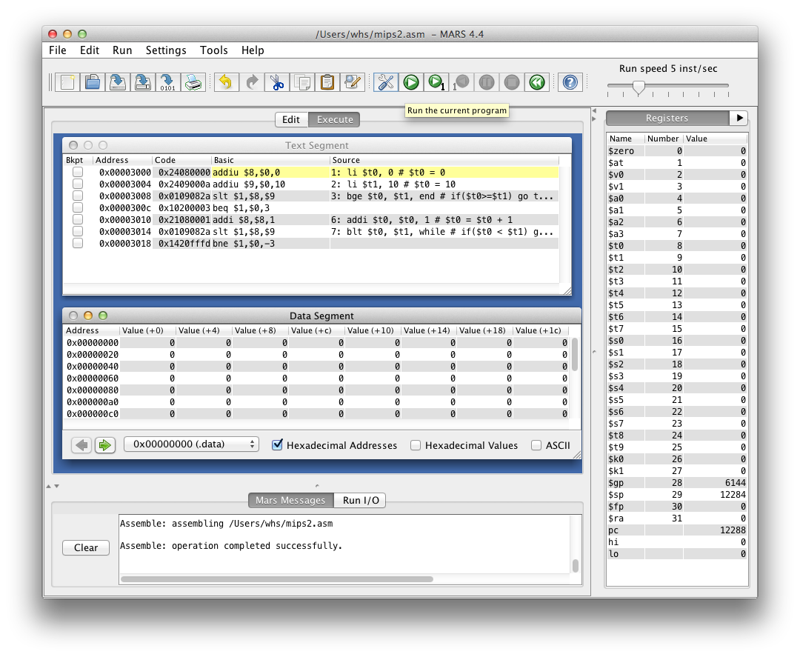

# เริ่มต้น MIPS Assembly

- จะใช้โปรแกรม MARS หรือจะใช้ QtSpim ก็ได้แต่ว่า Mars มี editor ให้ในตัวด้วย
- [Download MARS](http://courses.missouristate.edu/KenVollmar/MARS/MARS_4_4_Aug2013/Mars4_4.jar)

## Setup

MARS จะมาเป็นรูปแบบของ jar สามารถใช้ได้ทุก OS ที่ลง Java แล้วในไฟล์เดียว



เมื่อเปิดโปรแกรมขึ้นมาจะพบกับหน้าตาดังภาพ ให้ปรับขนาดหน้าต่าง Mars Message ลงเล็กๆ เพื่อให้เห็นหน้าต่าง Edit ใหญ่ขึ้น จากนั้นเข้าไปที่ Settings>Memory configuration เลือก Compact, Data at Address 0 แล้วกด Apply and close เพื่อให้หน่วยความจำที่เราใช้อยู่ก่อนโค้ด

## Coding

การเขียนโค้ดทำได้ด้วยการ New ไฟล์โค้ดขึ้นมาก่อนจากนั้นสามารถเขียนได้ทันที

คำสั่งที่สามารถใช้ได้สามารถดูได้จาก [Wikipedia](https://en.wikipedia.org/wiki/MIPS_instruction_set#MIPS_assembly_language)

### Example code
x = 5 * (6+y) โดย x อยู่ในหน่วยความจำตำแหน่งที่ 2000 และ y อยู่ในตำแหน่งที่ 2004

```
li $t9, 2000 # set $t9 = 2000
lw $t0, 4($t9) # $t0 = data in address $t9 + 4 = 2000 + 4 = 2004
addi $t0, $t0, 6 # $t0 = $t0 + 6
mul $t0, $t0, 5 # $t0 = $t0*5
sw $t0, 0($t9) # store $t0 to memory address $t9+0 = 2000 + 0 = 2000
```

### ตัวแปร

ใน assembly ไม่มีตัวแปรแต่จะมีที่เก็บข้อมูลที่เรียกว่า register โดย register ที่ใช้พักข้อมูลได้แก่ `$t0` - `$t9`

เมื่อต้องการใช้ตัวแปรที่มีมากกว่า 10 ตัวจะต้องเอาตัวแปรไปเก็บไว้ใน memory โดยใช้คำสั่ง `lw` เพื่อดึงค่าจาก memory เข้ามายัง register ที่ต้องการ และคำสั่ง `sw` เพื่อเอาค่าใน register กลับเข้าไปใน memory

ข้อควรรู้คือการใช้ lw นั้นจะโหลดข้อมูลมา 3 bytes ฉะนั้นเมื่อต้องการเข้าถึงหน่วยความจำตำแหน่งต่อไปจะต้องเลื่อนไป 4 ตำแหน่ง ไม่ใช่ 1 ต่ำแหน่ง

### ค่าคงที่

ใน assembly ไม่สามารถใช้ค่าคงที่ในคำสั่งลอยๆ ได้ทุกค่ำสั่ง  บางคำสั่งอาจจะรับค่าคงที่ไปได้ บางคำสั่งไม่รับ (บางคำสั่งอาจจะไม่รับตรงๆ แต่ว่า assembler จะแปลงเป็นสองคำสั่งให้เราอัตโนมัติได้ต้องดูใน autocomplete ของ MARS ว่ามีแบบไหนบ้าง)

วิธีการใช้ค่าคงที่ในคำสั่งต่างๆ ทำได้ด้วยการเซตค่าคงที่ไปใน register ว่างๆ ก่อนแล้วนำมาใช้

```
addi $t9, $zero, 5 # $t9 = 0 + 5
```

สังเกตว่าเราจะเซตด้วยการเอา $zero ซึ่งเป็น register พิเศษที่มีค่าเป็น 0 เสมอมาบวกกับค่าคงที่

นอกจากนี้ยังมีอีกคำสั่งหนึ่งที่ได้ผลเหมือนกัน

```
li $t9, 5 $t9 = 5
```

คำสั่ง `li` เป็นคำสั่งเทียม (pseudo instruction) ซึ่งด้านหลังแล้ว assembler จะแปลงกลับเป็นรูป `addi` ให้

### Loop and label

ใน assembly ไม่มี loop แต่ว่าจะใช้การกระโดดถอยกลับเพื่อวนซ้ำ โดยจะต้องตั้งชื่อเรียกไว้ก่อนแล้วสั่งให้กระโดดกลับไปด้วยคำสั่งประเภท jump ทั้งมีเงื่อนไข และไม่มีเงื่อนไข

#### Infinite loop

```c
int x = 0;
while(true){
	x++;
}
```

```
li $t0, 0 # $t0 = 0

myloop: # can be any name
addi $t0, $t0, 1 # $t0 = $t0 + 1
j myloop # go back to myloop
```

#### While loop

```c
int x = 0;
while(x < 10){
	x++;
}
```

```
li $t0, 0 # $t0 = 0
li $t1, 10 # $t0 = 10
bge $t0, $t1, end # if($t0>=$t1) go to end

while: # can be any name
addi $t0, $t0, 1 # $t0 = $t0 + 1
blt $t0, $t1, while # if($t0 < $t1) go to while

end: #can be any name
# nothing here
```

จะเห็นว่าโค้ดด้านบนสำหรับ while loop นั้นจริงๆ แล้วจะคล้ายกับ do..while loop มากกว่า คือ

```c
int x = 0;
if(x < 10){
	do{
		x++;
	}while(x < 10);
}
```

#### Do..While Loop

จากข้อด้านบนถ้าเราเอาคำสั่งเช็คเงื่อนไขตัวแรกออกก็จะได้ do..while เลย

```
li $t0, 0 # $t0 = 0
li $t1, 10 # $t0 = 10

while:
addi $t0, $t0, 1 # $t0 = $t0 + 1
blt $t0, $t1, while # if($t0 < $t1) go to while

end:
```

ความแตกต่างของ do while คือเข้าไปใน loop เสมอแม้ว่าเงื่อนไขจะตรงแล้ว แต่จะไม่วนซ้ำ ขณะที่ while ถ้าตรงตั้งแต่ก่อนเข้าแล้ว loop จะไม่ทำงานเลย

### Array

ใน assembly ไม่มีตัวแปรแต่สามารถใช้ตำแหน่งหน่วยความจำติดๆ กันในหน่วยความจำเป็น array ได้ (คล้ายกับในภาษาซี)

```
li $t0, 0 # set t0 to 0

loop:
sw $t0, 0($t0) # store $t0 to value at address $t0
addi $t0, $t0, 4 # $t0=$t0+4
j loop # loop infinitely
```

สังเกตว่าเราจะเลื่อนไปทีละ 4 ตำแหน่งเพราะว่าเมื่อ lw/sw นั้นจะโหลดมาทีละ 3 bytes ที่อยู่ติดกัน

## รัน

เมื่อเขียนโปรแกรมเสร็จแล้วให้เซฟไฟล์และกดปุ่มไขควงด้านบนเพื่อคอมไพล์ แล้วกดปุ่มรัน



เมื่อคอมไพล์ผ่านแล้วจะปรากฎหน้า Execute ขึ้นมาโดยด้านบน (Text Segment) จะแสดงโค้ดของเรา โดยคอลัมน์ Source คือโค้ดของเรา ส่วน Basic คือโค้ดที่ Assembler แปลงออกมาแล้วซึ่งบางคำสั่งอาจจะแปลงได้หลายคำสั่ง

ในส่วนของ Data Segment ให้ปรับ Drop down เป็น .data เพื่อแสดงค่าในหน่วยความจำ และติ๊ก Hexadecimal Values ออกเพื่อเปลี่ยนเป็นฐานสิบ ในหน้านี้เราสามารถกำหนดค่าตั้งต้นของหน่วยความจำได้ตามต้องการ

ในขณะรันเราสามารถปรับ Run speed ด้านบนได้ โดยถ้าปรับให้ไม่ทันทีจะเห็นว่าใน Text segment จะ highlight โค้ดปัจจุบันที่กำลังทำงาน และจะเห็นค่าของ Registers ด้านขวาเปลี่ยนไปตามการทำงานของโปรแกรม
