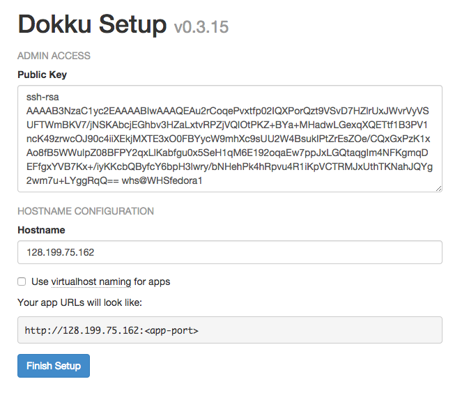

# ติดตั้ง Play framework บน DigitalOcean

## ขอ account

สามารถขอเครดิตฟรี $100 จาก GitHub ได้ที่ [GitHub for Education](https://education.github.com/discount_requests/new) โดยใช้เมล ku.ac.th (ไม่ใช่ ku.th)


ให้เอารหัสที่ได้ไปใส่ที่ [Promo](https://cloud.digitalocean.com/user_payment_profiles) ถ้าจะสมัครใหม่อย่าลืมใช้ [Referral code เรา](https://www.digitalocean.com/?refcode=4aeb73ddac2e) :p

## Add public key

*(ขั้นตอนการใช้ ssh-keygen ไม่ต้องทำ ถ้าเคยสร้าง ssh key ใน GitHub/Bitbucket ไปแล้ว)*

ให้ Generate ssh public key ขึ้นมา โดยสั่ง

```sh
ssh-keygen -t rsa -b 4096
```

แล้วคัดลอกข้อความในไฟล์ `~/.ssh/id_rsa.pub` (ใช้ nano หรือ subl เปิดก็ได้)

สำหรับ Windows ให้ลง Git แล้วเปิด Git Bash ขึ้นมารันคำสั่งเมื่อกี้ได้เลย ไฟล์จะอยู่ที่ `C:\Users\username\.ssh\id_rsa.pub` ใช้ notepad เปิดได้

----

*(ขั้นตอนนี้ต้องทำ)*

เข้าไปที่หน้า [SSH Keys](https://cloud.digitalocean.com/ssh_keys) กด Add SSH Key แล้ว Paste ข้อความลงไปในช่อง Public SSH Key ตั้งชื่อตามต้องการ

## Dokku

การติดตั้ง Play จะมี 2 วิธีด้วยกันคือลงด้วยระบบเปล่าๆ กับใช้ Dokku โดย Dokku เป็นโปรแกรมจำลองระบบให้เหมือนกับ Heroku ข้อดีของวิธีนี้คือไม่จำเป็นต้องเซต server ทั้งหมดเอง

**ข้อความรู้** แอพที่จะติดตั้งด้วย dokku ตัวโปรแกรมต้องอยู่ภายนอกสุดของ git เท่านั้น พูดง่ายๆ คือ เปิดเข้าไปใน GitHub ของ project เราแล้วจะต้องเห็นไฟล์ชื่อ build.sbt เลย

#### Framework อื่นๆ ด้วย Dokku

ถ้าจะหาวิธีติดตั้ง Framework อื่นๆ ให้ลองศึกษาดูว่าเซตลง Heroku ทำยังไง ก็ทำตามแบบเดียวกันได้หมดเลย ยกเว้นเวลา push ให้ push ไปที่ server เราแทน แล้วก็ตัว database เราอาจจะใช้ MySQL/MariaDB​ โดยติดตั้งตาม guide นี้ก็ได้ หรือจะลง Postgres แล้วติดตั้งตาาม guide ของ Heroku ก็ได้

(เท่าที่พอรู้คร่าวๆ Postgres ดีกว่า MySQL แต่เซตยุ่งยากเลยไม่ค่อยนิยม)

### Create VM

เข้าไปที่ [DigitalOcean Control Panel](https://cloud.digitalocean.com) กดที่ Create Droplet ซ้ายมือ กรอกรายละเอียดตามต้องการ

- Hostname อะไรก็ได้ แนะนำเป็นชื่อเว็บที่จะลงจริง เช่น gg.whs.in.th หรือถ้าไม่มีเว็บใส่เป็นชื่อเฉยๆ เช่น madoka ก็ได้
- Size เท่าไรก็ว่าไปเพราะแรมมันไม่พออยู่ดี 555
- Region ใช้ Singapore จะเข้าเร็วสุด
- Settings ไม่จำเป็นต้องเปิดอะไรเลย
- Image เลือก Application > Dokku ตามภาพ


- SSH Key เลือกเป็น Public Key ที่ใส่ไว้เมื่อกี้

เมื่อ create จะใช้เวลาประมาณ 1-2 นาทีแล้วจะมีอีเมลมาเตือนด้วย ก็ให้คลิกเข้าไปที่เครื่องในหน้า Droplet แล้วจด IP ไว้


### อัพแรม

ขั้นตอนต่อมา เนื่องจาก Play Framework กินแรมตอนคอมไพล์เยอะมากเลยจะต้องทำ swap file ก่อน (Windows เรียกว่า page file)

ให้เปิด Terminal/Git Bash มาแล้วสั่ง

```sh
ssh root@ip
```

(เปลี่ยน ip เป็นไอพีตามที่จดไว้ ถ้ามีคำถาม The authenticity ... ให้ตอบ `yes`)

เสร็จแล้วสร้าง swap file ขึ้นมาขนาด 1GB

```sh
dd if=/dev/zero of=swap bs=1M count=1024 # create a 1024*1MB empty file named swap
mkswap swap # format the file named swap as swap
swapon swap # enable swap at the file named swap
free -m
```

จะเห็นว่าในคำสั่ง `free -m` จะแสดงว่าเรามี swap เท่าไรซึ่งจะต้องมากกว่า 0 แสดงว่า Swap ได้ทำงานแล้ว

เสร็จแล้วเราจะกลับมาใช้ ssh อีกเยอะ อย่าเพิ่งปิดหน้าต่าง

### Setup Dokku

ให้เปิด browser เข้าไปที่ IP ของเครื่อง จะพบหน้าต่างตามภาพ



- ถ้ามีโดเมนให้กรอกโดเมนลงไปในช่อง hostname  และติ๊ก Use virtualhost naming for apps
- ถ้าไม่มีโดเมน ให้กรอกเลข IP ลงไปในช่อง hostname
- จะเห็นว่าช่อง admin ssh key จะกรอกไว้แล้วเป็นค่า public key ของเราที่เซฟเอาไว้ ไม่ต้องแก้อะไร

### Setup database

ขั้นต่อมาเราจะติดตั้ง Database server บน Server ให้กลับไปที่ ssh ที่เราเปิดค้างไว้ตอนอัพแรม แล้วสั่ง

```sh
cd /var/lib/dokku/plugins
git clone --recursive https://github.com/Kloadut/dokku-md-plugin mariadb
cd mariadb/dockerfiles
git checkout master
dokku plugins-install
```

คำสั่งหลังสุดจะรันนานมากเพราะมันจะติดตั้ง Ubuntu 14.04 อีกตัวและติดตั้ง MariaDB ลงไป

แล้วสร้าง database ใหม่

```sh
dokku mariadb:create projectname
```

(ตรง projectname ให้ใส่เป็นชื่อ URL ที่จะเข้าในกรณีที่เปิด virtualhost naming ไว้ เช่น ถ้ากรอก hostname ไปว่า `gg.whs.in.th` ก็จะเข้าแอพได้ที่ `projectname.gg.whs.in.th`)

---

ให้ติดตั้ง plugin สำหรับต่อ MySQL บน Play โดยเปิด `build.sbt` มาแก้ไข `libraryDependencies`

```
libraryDependencies ++= Seq(
  javaJdbc,
  javaEbean,
  cache,
  javaWs,
  "org.mariadb.jdbc" % "mariadb-java-client" % "1.1.8"
)
```

(ดูตัวอย่างใน [TeamGG](https://github.com/SSD2015/TeamGG/blob/master/build.sbt) ได้)

และสร้างไฟล์ `Procfile` (P ใหญ่) ไว้นอกสุดของ git เขียนว่า

```yaml
web: target/universal/stage/bin/myapp -Dhttp.port=${PORT} -DapplyEvolutions.default=true -Ddb.default.driver=org.mariadb.jdbc.Driver -Ddb.default.url=jdbc:mysql://172.17.42.1:49153/db\?user=root\&password=5PE7DYsaevADJadb
```

- แก้คำว่า myapp ให้เป็นชื่อโปรแกรมของเราตามที่เขียนไว้ใน build.sbt (เช่น `name := """exceedvote"""` ก็ใส่ว่า `target/universal/stage/bin/exceedvote`) อันนี้ไม่ใช่ projectname ที่กำหนดในขั้นตอนเมื่อกี้ ให้ยึดตาม build.sbt อย่างเดียว
- แก้ตรง url โดยใส่ข้อมูล mysql ตามที่โปรแกรมให้มาตอนสั่ง create ในรูปแบบ `jdbc:mysql://IP:PORT/database\?user=root\&password=password`
  - ปกติแล้ว Dokku จะสร้าง URL ตรงนี้ให้ แต่ต้องมานั่งเขียนเองเพราะ URL ที่ให้มานั้น Play ไม่รองรับ

Commit การแก้ไขทั้งหมดลง git

```sh
git add Procfile
git commit -a -m "Added Procfile"
```

### Install

ให้เปิด terminal/Git Bash ไปที่ folder ของ project เราแล้วสั่ง

```sh
git remote add dokku dokku@ip:projectname
```

(อย่าลืมเปลี่ยน ip กับ projectname ให้ถูกต้อง​)

จากนั้นทุกครั้งที่ต้องการอัพเดตแอพ ให้สั่ง

```sh
git push dokku master
```

ตัว Dokku จะคอมไพล์แอพของเราให้และติดตั้งให้พร้อมใช้งาน (ขั้นตอนนี้จะใช้เวลานานมากในครั้งแรกเพราะโปรแกรมจะโหลด Play Framework มาติดตั้งให้) เมื่อเสร็จแล้วจะขึ้น URL ให้มา (ถ้าลงแบบ IP ตัว port อาจจะเปลี่ยนไปเรื่อยๆ)


ถ้า deploy สำเร็จแล้วแอพไม่ขึ้นอาจจะมีปัญหาเรื่องการเซต database ลองดู log ดู

### Maintenance

ลงเสร็จแล้วอาจจะมีกระบวนการบางอย่างที่อยากจะทำ เช่น

#### ดู log

ในกรณีที่แอพมีปัญหาใช้งานไม่ได้ ลองเปิด log ดูอาจจะรู้สาเหตุได้ โดย ssh เข้าไปแล้วสั่ง

```sh
dokku logs projectname
```

#### Reboot

ในกรณีที่ reboot เครื่อง swap ที่ทำไว้จะหลุด แอพน่าจะรันได้ไม่มีปัญหา แต่เวลา push อาจจะ error แรมไม่พอ ให้ ssh เข้าไปเปิด swap ด้วยคำสั่ง

```sh
swapon swap
```

(มีวิธีถาวรอยู่ ลองหาเรื่อง fstab อ่านถ้าจะเซตละกัน)

## ติดตั้งมือ

วิธีการติดตั้งมือนั้นจะซับซ้อนน้อยกว่าการใช้ Dokku และยืดหยุ่นกว่า แต่ก็มีขั้นตอนเยอะอยู่เหมือนกัน

// ไว้เขียนต่อ